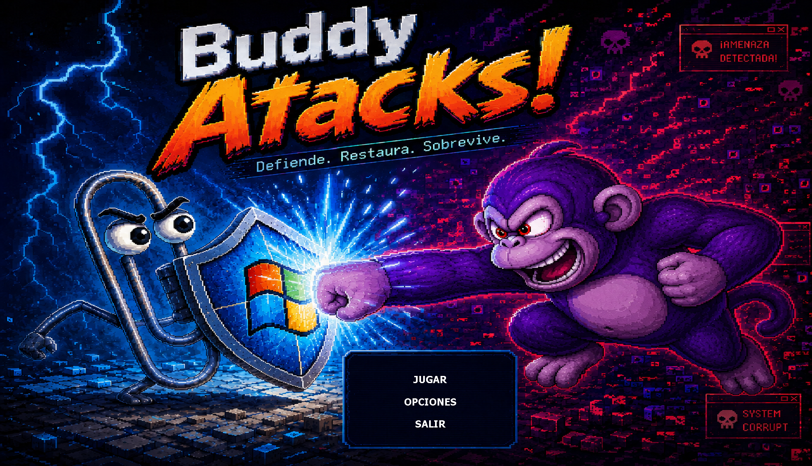
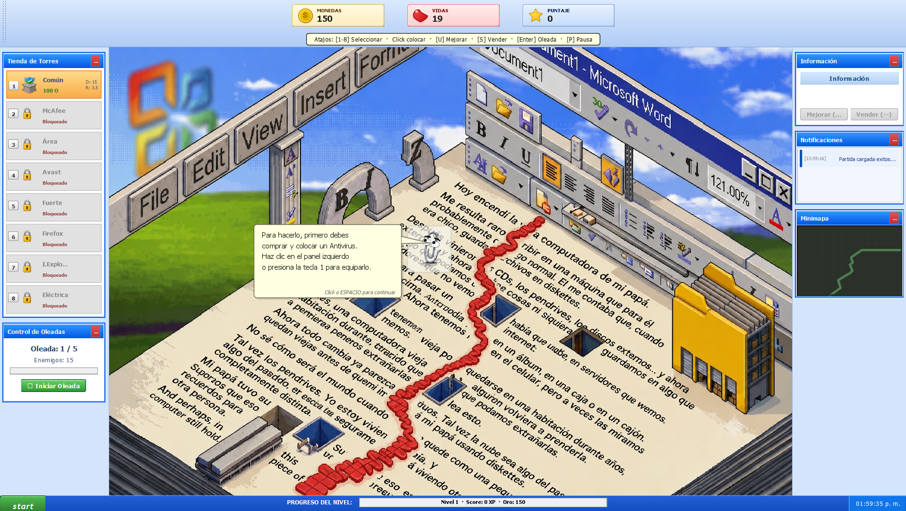
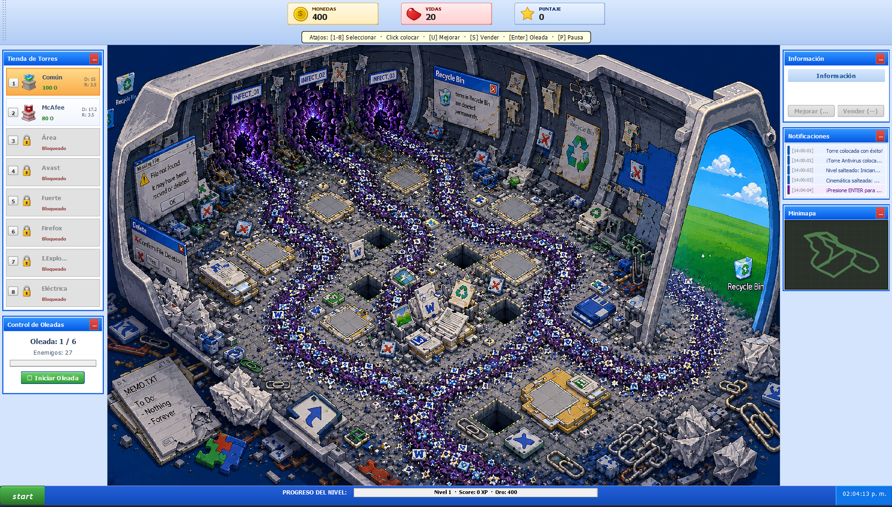
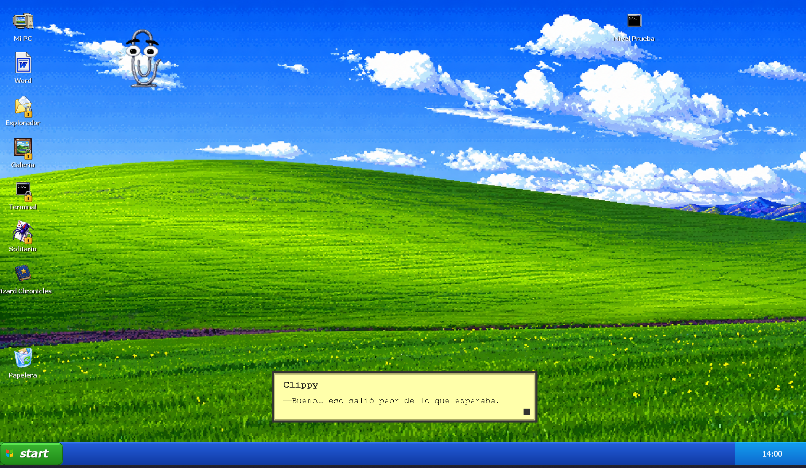
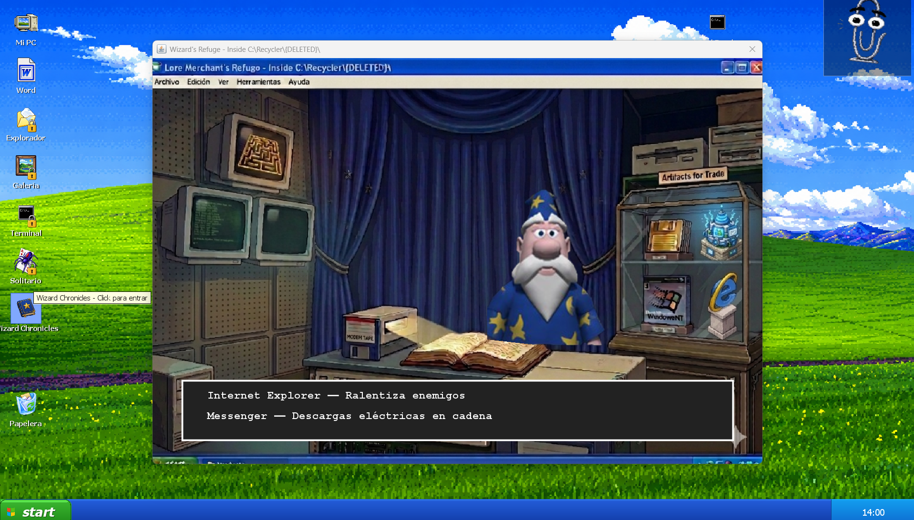
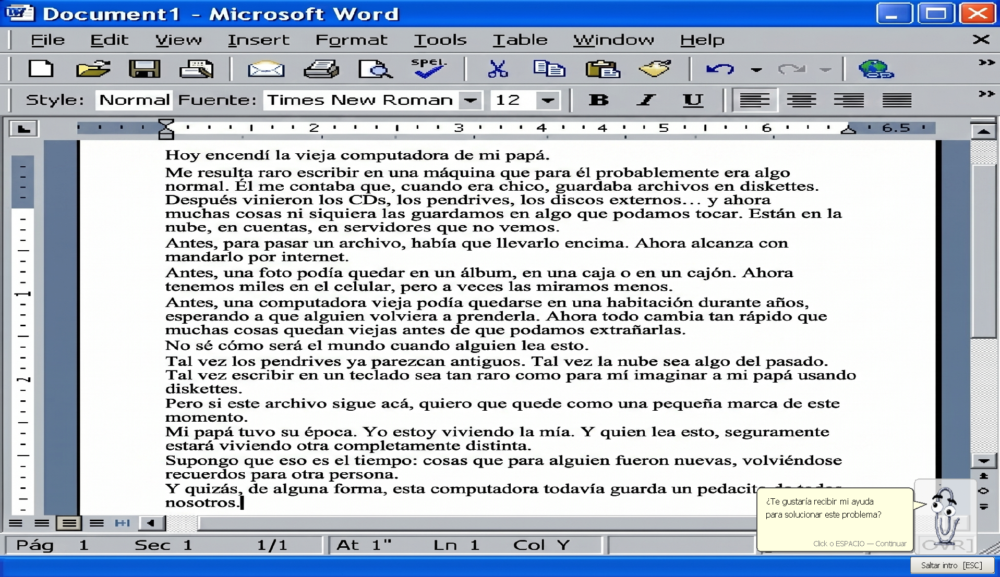
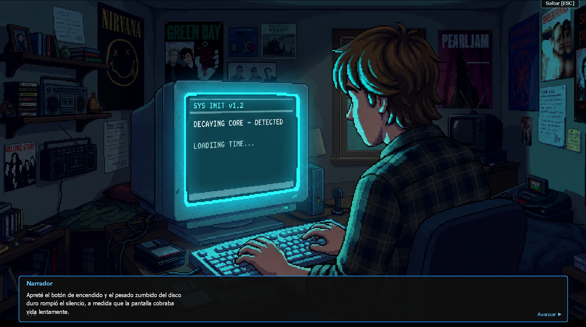

<h1 align="center">
  
  <br>
  💾 Windows XP Tower Defense 🛡️
</h1>

<p align="center">
  <strong>Un cl&aacute;sico juego de Tower Defense ambientado en el nost&aacute;lgico universo de Windows XP. &iexcl;Defend&eacute; tu PC de virus, malware y del temible Boss Peedy!</strong>
</p>

---

## 🎮 Sobre el Juego

En **Windows XP Tower Defense**, tu computadora est&aacute; bajo ataque. Cientos de procesos maliciosos, troyanos y virus de la vieja escuela (como *Ares* y *Fake Firewalls*) intentan destruir tu sistema operativo. 

Tu misi&oacute;n es colocar torres antivirus estrat&eacute;gicamente a lo largo de los circuitos para purgar la amenaza antes de que sea demasiado tarde. Cuenta con niveles progresivos, econom&iacute;a in-game, y la inestimable (y a veces molesta) ayuda de **Clippy**.

<p align="center">
  
  
</p>

## ✨ Caracter&iacute;sticas Principales

* 💿 **Nostalgia Pura**: Gr&aacute;ficos, sonidos y est&eacute;tica fiel a la era dorada de Windows XP.
* 🗼 **Torres Antivirus &Uacute;nicas**:
  * **Torre McAfee**: Disparo r&aacute;pido y letal.
  * **Torre Internet Explorer**: &iexcl;Congela (ralentiza) a los enemigos por su legendaria lentitud!
  * **Torre Firefox**: Aplica da&ntilde;o de quemadura en &aacute;rea.
  * **Torre Messenger**: Proyectiles que rebotan entre los enemigos como mensajes de chat.
* 👾 **Enemigos Inform&aacute;ticos**: Defendete de *MiniIdiots*, software de descargas P2P como *Ares*, Pop-Ups corruptos y enfrent&aacute; al jefe final: **El Loro Peedy**.
* 🧙‍♂️ **Mercader Wizard**: Un asistente cl&aacute;sico que te permitir&aacute; comprar mejoras y gestionar tus recursos en el *Hub*.
* 🏆 **Sistema de Puntuaci&oacute;n**: Tablas de posiciones (Scoreboards) persistentes para competir por el top 10.

---

## 🖼️ Galer&iacute;a

<p align="center">
  
  
</p>

<p align="center">
  
  
</p>

---

## 🚀 C&oacute;mo Jugar

El proyecto cuenta con un ejecutable auto-contenido (Fat JAR) para que puedas jugar instant&aacute;neamente, o pod&eacute;s compilarlo y correrlo usando **Gradle** y **Java 21**.

### Ejecuci&oacute;n R&aacute;pida
Si descargaste el archivo `.jar` de la versi&oacute;n final, simplemente hac&eacute; doble clic sobre &eacute;l o ejecutalo desde consola:
```bash
java -jar prog-2-java-template-1.0.0.jar
```

### Desde el C&oacute;digo Fuente
1. Asegurate de tener **Java 21** instalado.
2. Clona el repositorio y ejecuta el comando de Gradle:

```bash
# Para correr el juego directamente
./gradlew run

# Para compilar y generar un nuevo ejecutable JAR
./gradlew jar

# Para ejecutar todos los tests del modelo
./gradlew test
```

---

## ⚙️ Arquitectura y Dise&ntilde;o (Dev Docs)

Este proyecto fue desarrollado bajo estrictos est&aacute;ndares acad&eacute;micos de Ingenier&iacute;a de Software:
- **Patr&oacute;n MVC (Modelo-Vista-Controlador)**: Total desacople entre la l&oacute;gica de negocios y la interfaz gr&aacute;fica. El modelo de dominio es agn&oacute;stico a la vista.
- **Programaci&oacute;n Orientada a Objetos**: Uso avanzado de Abstracci&oacute;n, Herencia, Polimorfismo y Composici&oacute;n. Se aplican conceptos como M&aacute;quinas de Estado (Enums) para la IA de enemigos y Generics para manejar oleadas de forma type-safe (`Oleada<T extends Enemigo>`).
- **Test Driven & Alta Cobertura**: M&aacute;s del **80% de code coverage** enfocado en el dominio, validado mediante simulaci&oacute;n de estados por consola sin levantar un solo Frame gr&aacute;fico.
